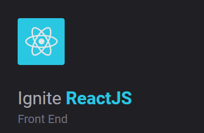

# :rocket: Ignite Rocketseat

<a href="https://rocketseat.com.br/" target="_blank">Rocketseat</a> Ignite React Course.

## :file_folder: Folders
#### /chapter-1
* github-explorer\
Simple React application to show the list of repositories from a GitHub user.

#### /chapter-2
* dtmoney\
React application for financial control of expenses and incomings.

#### /chapter-3
* ignews\
Next application to show and register news using Stripe, FaunaDB and Prismic CMS.

#### /chapter-4
* dashgo\
Next dashboard application made with chakra-ui.

* ignite-reactjs-auth-backend\
Node backend application including authentication endpoints.

* nextauth\
Next app containing authentication system.

#### /chapter-5
* perf-application\
Next app containing mocks results and a simple search component implementing performance solutions

