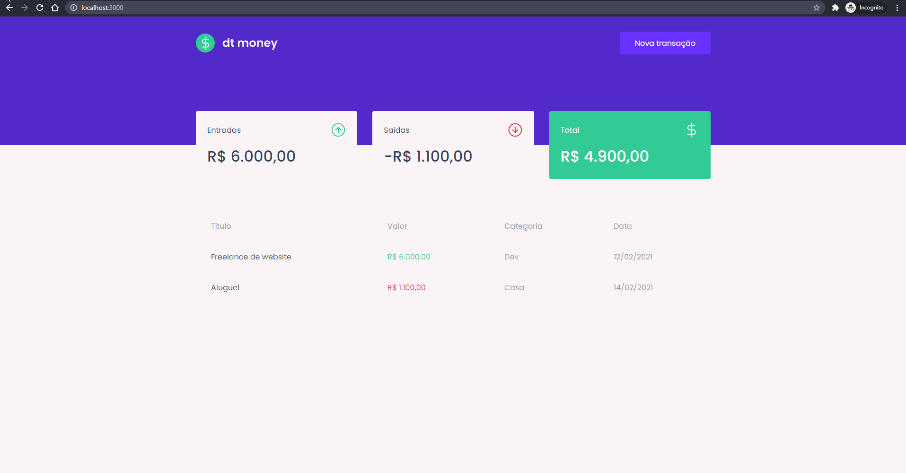

# Chapter 02
## DT Money

React application for financial control of expenses and incomings.\
Application developed from ```npx create react app```.

[Figma Application Layout](https://www.figma.com/file/0xmu9mj2TJYoIOubBFWsk5/dtmoney-Ignite-(Copy)?node-id=0%3A1 "Figma Application Layout")

## Preview


### Run the application
```
npm start
```

[http://localhost:3000](http://localhost:3000 "localhost")


## Challenge 02 - Creating a shopping cart hook
[Template](https://github.com/rocketseat-education/ignite-template-reactjs-criando-um-hook-de-carrinho-de-compras "Template")\
[Challenge 02](https://www.notion.so/Desafio-02-Componentizando-a-aplica-o-b9f0f025c95b437699d0c3115f55b0f1 "Challenge 02")\
[Solution](https://github.com/EDusik/ignite-react-challenge-02 "Solution")