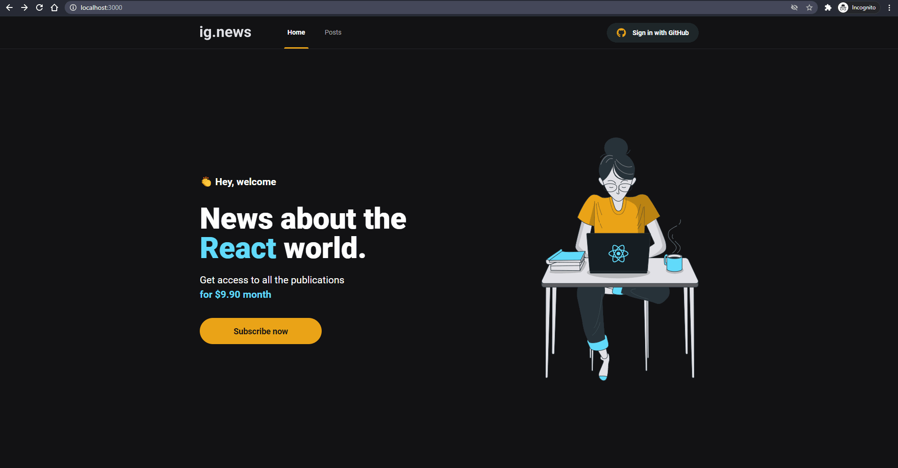

# Chapter 03
## Ig News

Next application to show and register news using Stripe, FaunaDB and Prismic CMS.\
Application developed from ```npx create-next-app```.

[Figma Application Layout](https://www.figma.com/file/gl0fHkQgvaUfXNjuwGtDDs/ig.news "Figma Application Layout")

## Preview


### Technologies

- [Stripe](https://stripe.com/)
- [Fauna](https://fauna.com/)
- [Prismic CMS](https://prismic.io/)

### Packages

```npm
npm install typescript @types/react @types/node -D
npm install sass
npm install stripe
npm install next-auth
npm install axios
npm install @stripe/stripe-js
npm install @prismicio/client
npm install prismic-dom
npm install @types/prismic-dom -D
```

- [Stripe Cli](https://github.com/stripe/stripe-cli)

```stripe
stripe login
stripe listen --forward-to localhost:3000/api/webhooks
```
### Run the application
```npm
npm run dev
```

[http://localhost:3000](http://localhost:3000 "localhost")

## Challenge 06 - Create a Project from the Beginning
[Template](https://github.com/rocketseat-education/ignite-template-reactjs-criando-um-projeto-do-zero "Template")\
[Challenge 06](https://www.notion.so/Desafio-01-Criando-um-projeto-do-zero-b1a3645d286b4eec93f5f1f5476d0ff7 "Challenge 03")\
[Solution](https://github.com/EDusik/ignite-react-challenges/tree/master/06-adding-features-to-blog "Solution")
